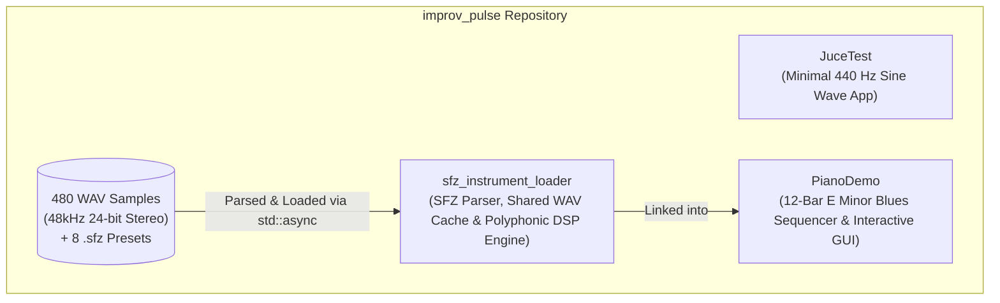
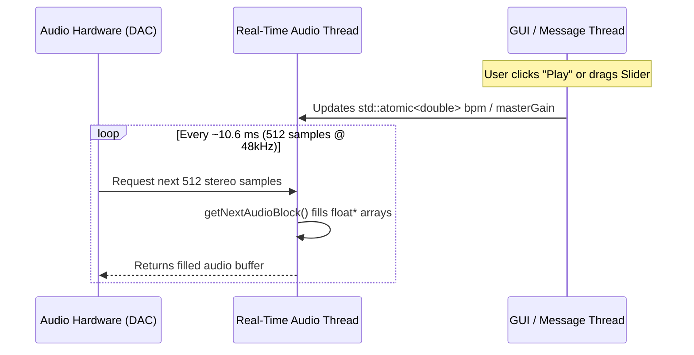
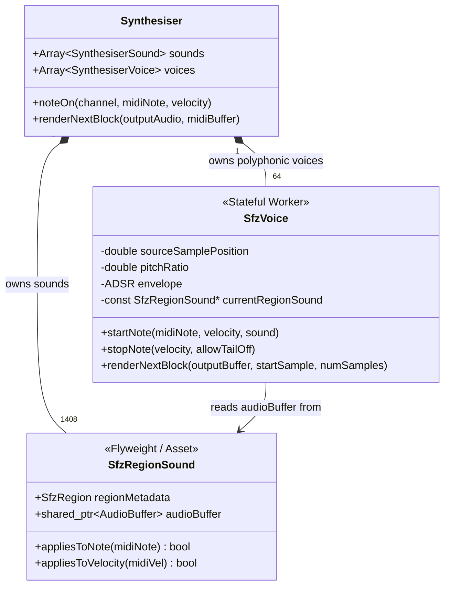

# C++ Developer's Guide to Audio Programming & JUCE 8
### Mastering the `improv_pulse` Codebase: From Sine Waves to a 16-Layer 48kHz Grand Piano Sampler

Welcome! Since you already know C++, you have all the foundational tools needed to write high-performance audio software. Audio programming in C++ doesn't require learning a new language—it requires learning a **new execution model** (real-time stream processing) and **domain primitives** (samples, buffers, phase, decibels, envelopes, and MIDI events).

This tutorial walks you through every layer of the `improv_pulse` repository, starting from a 100-line sine wave generator and building up to our multi-threaded 48kHz/24-bit SFZ grand piano sampler and sample-accurate 12-bar blues sequencer.

---

## Architecture Overview

Here is how the three applications and libraries in this workspace fit together:



---

## Module 1: The Mental Model of Digital Audio (For C++ Engineers)

### 1.1 What is Digital Audio in Memory?
In C++, digital audio is simply an array of floating-point numbers (`float*`), where each number represents the **instantaneous air pressure displacement** (speaker cone position) at a specific point in time:
- **`0.0f`** means silence (equilibrium).
- **`+1.0f`** is maximum positive excursion; **`-1.0f`** is maximum negative excursion.
- Values beyond `[-1.0f, +1.0f]` exceed the Digital-to-Analog Converter (DAC) headroom and **clip** (causing harsh digital distortion).

To represent continuous sound waves digitally, the audio hardware captures or plays back discrete snapshots at a fixed **Sample Rate ($f_s$)**:
- **$44,100\text{ Hz}$** (CD quality): $44,100$ `float` samples per second per channel.
- **$48,000\text{ Hz}$** (Studio/Video standard, used by our Salamander Grand Piano WAVs): $48,000$ `float` samples per second per channel.

### 1.2 The Real-Time Audio Callback Thread vs. GUI Thread
In a standard C++ GUI application, your program waits for events (mouse clicks, key presses, timers) on a single **Message Thread**.

In an audio program, the operating system's audio driver (ALSA/JACK on Linux, WASAPI/ASIO on Windows, CoreAudio on macOS) spawns a dedicated, **high-priority Real-Time Audio Thread**. Every few milliseconds, the hardware interrupts your program and says:
> *"Give me the next **512 samples** for the Left and Right speakers right now. You have **10.6 milliseconds** ($512 / 48000\text{ s}$) to fill this buffer before the speaker runs out of data!"*



> [!CAUTION]
> **The Golden Rule of Audio Programming**: Inside the audio callback (`getNextAudioBlock()`), you must **NEVER** perform operations with unbounded or non-deterministic execution time:
> 1. **No heap allocations (`new`, `delete`, `malloc`, `std::vector::push_back`)** — the global heap allocator acquires OS locks.
> 2. **No blocking mutexes (`std::mutex::lock()`)** — if the GUI thread holds the lock, the audio thread stalls, causing an immediate audible click/pop (**buffer underrun / xrun**).
> 3. **No disk I/O or network calls (`std::ifstream`, `printf`)**.
>
> Instead, pre-allocate memory in `prepareToPlay()`, load files on background worker threads (`juce::Thread` / `std::async`), and pass parameters between the GUI and Audio threads using lock-free **`std::atomic<T>`** variables.

---

### 1.3 Walkthrough: Your First Audio App (`JuceTest`)

Open [`JuceTest/main.cpp`](file:///usr/local/google/home/mhorowitzgelb/improv_pulse/JuceTest/main.cpp). This 100-line file demonstrates how JUCE structures a C++ audio application.

#### How JUCE Replaces `int main()`
At the very bottom of [`JuceTest/main.cpp`](file:///usr/local/google/home/mhorowitzgelb/improv_pulse/JuceTest/main.cpp#L63-L101), you'll see:
```cpp
class JuceTestApplication : public juce::JUCEApplication { ... };
START_JUCE_APPLICATION (JuceTestApplication)
```
`START_JUCE_APPLICATION` is a C++ macro that generates the platform-specific entry point (`main()` on Linux, `WinMain()` on Windows), initializes the OS GUI event loop, and calls `JuceTestApplication::initialise()`, which creates the window containing `MainComponent`.

#### The Core Audio Lifecycle in `MainComponent`
Look at [`MainComponent`](file:///usr/local/google/home/mhorowitzgelb/improv_pulse/JuceTest/main.cpp#L5-L61), which inherits from `juce::AudioAppComponent`. Every `AudioAppComponent` implements three core audio methods:

1. **`prepareToPlay (int samplesPerBlockExpected, double sampleRate)`** ([lines 16–24](file:///usr/local/google/home/mhorowitzgelb/improv_pulse/JuceTest/main.cpp#L16-L24)):
   Called **before** audio playback starts (or whenever the user changes soundcards/sample rates). Here we compute how much the sine wave's angle ($\text{phase}$, in radians $0 \dots 2\pi$) must advance on each individual sample frame to produce a $440\text{ Hz}$ tone (Concert A4):
   $$\Delta\phi = \frac{2\pi \cdot f_{\text{target}}}{f_s} = \frac{2\pi \cdot 440.0}{\text{sampleRate}}$$
   ```cpp
   const double targetFrequency = 440.0; // A440 tone
   phaseDelta = (targetFrequency * 2.0 * juce::MathConstants<double>::pi) / currentSampleRate;
   ```

2. **`getNextAudioBlock (const juce::AudioSourceChannelInfo& bufferToFill)`** ([lines 26–42](file:///usr/local/google/home/mhorowitzgelb/improv_pulse/JuceTest/main.cpp#L26-L42)):
   Called ~90 times per second on the **Real-Time Audio Thread**.
   - `bufferToFill.buffer` is a `juce::AudioBuffer<float>*` (a 2D array: `[channel][sampleIndex]`).
   - We grab raw C++ pointers (`float*`) to the Left (`0`) and Right (`1`) channels:
     ```cpp
     auto* leftBuffer  = bufferToFill.buffer->getWritePointer (0, bufferToFill.startSample);
     auto* rightBuffer = bufferToFill.buffer->getWritePointer (1, bufferToFill.startSample);
     ```
   - Then we loop `sample` from `0` to `bufferToFill.numSamples - 1`, evaluating $\sin(\phi)$ and advancing `phase += phaseDelta`:
     ```cpp
     for (int sample = 0; sample < bufferToFill.numSamples; ++sample) {
         const float sampleValue = std::sin (phase) * 0.1f; // 0.1f gain = -20 dB safe volume
         leftBuffer[sample]  = sampleValue;
         rightBuffer[sample] = sampleValue;
         phase += phaseDelta;
         if (phase >= juce::MathConstants<double>::twoPi)
             phase -= juce::MathConstants<double>::twoPi;
     }
     ```

---

## Module 2: How Software Instruments Work — MIDI, Sounds & Voices

A continuous sine wave never stops ringing. To build a piano, we need:
1. **Events** that tell us *when* a key is pressed, *which* key was pressed, and *how hard* it was struck.
2. **Polyphony**: The ability to play multiple notes simultaneously (e.g., a 6-note blues chord).

### 2.1 What is MIDI?
**MIDI (Musical Instrument Digital Interface)** does **not** contain audio waveforms. It is a stream of lightweight event structs:
- **`Note On`**: Contains **Channel** (`1..16`), **Note Number** (`0..127`, where `21` is $A_0$, `60` is Middle C $C_4$, and `108` is $C_8$), and **Velocity** (`1..127` or normalized `0.0f..1.0f`, representing strike force).
- **`Note Off`**: Triggered when the finger lifts off the key (`midiNoteNumber`).
- **`Control Change (CC)`**: Continuous controllers like the Sustain Pedal (`CC64`, where values $\ge 64$ mean pedal down, $< 64$ mean pedal up).

In JUCE, these events are passed into each audio block via a **`juce::MidiBuffer`**, where each MIDI event has a `samplePosition` integer (`0 .. numSamples - 1`) indicating the exact sample frame within the current audio block where the event occurred.

### 2.2 JUCE's Synthesiser Architecture: `Sound` vs. `Voice`
To handle polyphony cleanly in C++, JUCE's [`juce::Synthesiser`](file:///usr/local/google/home/mhorowitzgelb/improv_pulse/sfz_instrument_loader/SfzInstrumentLoader.h#L121-L130) uses the **Flyweight Design Pattern**, splitting an instrument into two classes:



1. **`juce::SynthesiserSound` (Read-Only Asset / Flyweight)**:
   - Implemented in our codebase by [`sfz::SfzRegionSound`](file:///usr/local/google/home/mhorowitzgelb/improv_pulse/sfz_instrument_loader/SfzInstrumentLoader.h#L62-L82).
   - Holds immutable audio sample data (`std::shared_ptr<const juce::AudioBuffer<float>>`) and answers two questions: `appliesToNote(midiNote)` and `appliesToVelocity(midiVel)`.
   - It holds **zero playback state** (no playback cursor!). Multiple voices can read from the same `SfzRegionSound` simultaneously.

2. **`juce::SynthesiserVoice` (Stateful Worker)**:
   - Implemented by [`sfz::SfzVoice`](file:///usr/local/google/home/mhorowitzgelb/improv_pulse/sfz_instrument_loader/SfzInstrumentLoader.h#L88-L115).
   - Represents a single "virtual string/hammer" capable of playing one note at a time.
   - Holds the mutable playback state for that specific note strike:
     - `double sourceSamplePosition`: The fractional index inside the WAV buffer currently being played.
     - `double pitchRatio`: How fast `sourceSamplePosition` advances per output sample.
     - `juce::ADSR adsr`: The volume envelope (Attack, Decay, Sustain, Release) for smooth note fade-in and damper fade-out.
   - In [`SfzSynthesiser`](file:///usr/local/google/home/mhorowitzgelb/improv_pulse/sfz_instrument_loader/SfzInstrumentLoader.cpp#L240-L246), we allocate **64 `SfzVoice` instances** in the constructor:
     ```cpp
     SfzSynthesiser::SfzSynthesiser() {
         setNoteStealingEnabled (true);
         for (int i = 0; i < 64; ++i)
             addVoice (new SfzVoice());
     }
     ```
     When `renderNextBlock()` runs on the audio thread, JUCE loops through all active voices and sums their audio into `outputBuffer`.

---

## Module 3: Deep Dive into `sfz_instrument_loader`

### 3.1 How the Accurate Salamander Grand Piano V6.2 Works
Why does a high-end piano soundbank need `.sfz` files and **480 WAV files** instead of just 88 WAV files (one per key)?

1. **16 Velocity Layers (`v01` to `v16`)**:
   When you strike a real grand piano key softly (`pp`, velocity 15), the felt hammer gently nudges the string, producing a warm, mellow tone with very few high harmonics. When struck hard (`ff`, velocity 125), the compressed felt reflects sharp, bright, percussive high-frequency overtones. Simply turning down the volume of a loud recording sounds unnatural and lifeless. Therefore, the piano was recorded at **16 distinct strike velocities per note**.
2. **Minor-Third Chromatic Mapping (30 Pitches $\times$ 16 Layers = 480 WAVs)**:
   To save gigabytes of disk space without sacrificing acoustic realism, every 3rd semitone ($A_0, C_1, D\#_1, F\#_1, \dots, C_8$ — 30 pitches total) was recorded across 16 velocities.
   In the `.sfz` definition ([`Accurate-SalamanderGrandPiano_flat.Recommended.sfz`](file:///usr/local/google/home/mhorowitzgelb/improv_pulse/sfz_instrument_loader/salamander_piano/sfz_daw/Accurate-SalamanderGrandPiano_flat.Recommended.sfz#L114-L167)), each un-sampled neighbor key ($A\#_0, B_0$) borrows the closest WAV file ($A_0$ or $C_1$) and specifies:
   - `pitch_keycenter`: The root MIDI note of the WAV file (e.g., `21` for $A_0$).
   - `lokey` / `hikey`: The target key on the keyboard (e.g., `22` for $A\#_0$).
   - `offset`: The exact sample frame where playback should start (`offset=48` for unshifted, `offset=5` for $+1$ semitone, `offset=88` for $-1$ semitone) so that pitch-shifting doesn't alter the millisecond delay of the hammer strike!
   - `tune`: Fine pitch correction in cents ($1/100\text{th}$ of a semitone).
   - `volume`: Fine loudness balance in decibels ($\text{dB}$).

### 3.2 Shared Memory Caching (`sfz::SampleBufferCache`)
Because 88 keys $\times$ 16 layers = **1,408 `<region>` definitions** point to only **480 unique `.wav` files**, naively loading a separate `AudioBuffer` per region would read disk 1,408 times and waste **3.5 GB of RAM** duplicating audio buffers!

Look at [`SampleBufferCache::getOrLoad()`](file:///usr/local/google/home/mhorowitzgelb/improv_pulse/sfz_instrument_loader/SfzInstrumentLoader.cpp#L19-L69):
```cpp
SampleBufferCache::CachedSample SampleBufferCache::getOrLoad (
    const juce::File& wavFile,
    juce::AudioFormatManager& formatManager,
    double maxDurationSeconds)
{
    const std::string key = wavFile.getFullPathName().toStdString();
    {
        std::lock_guard<std::mutex> lock (mutex);
        auto it = cache.find (key);
        if (it != cache.end())
            return it->second; // Cache hit! Return shared_ptr immediately
    }
    // ... Decode WAV file outside the mutex lock so 8 threads decode in parallel ...
```
- Notice that the mutex lock is **released** before reading and decoding the WAV file from disk! This allows all 8 background worker threads to read and decode different WAV files in true CPU parallelism.
- Every `SfzRegionSound` stores a `std::shared_ptr<const juce::AudioBuffer<float>>`. Thus, $A_0$, $A\#_0$, and $B_0$ all point to the exact same floating-point memory buffer.
- **Bonus Benefit**: When you switch between the 8 SFZ Tone Presets in `PianoDemo` (`Flat`, `Bass +1.5 dB`, `Treble +2.0 dB`), all 480 WAV files are already in `SampleBufferCache`. Switching presets takes **$< 1\text{ millisecond}$** with zero disk I/O!

---

### 3.3 Multi-Threaded Progressive Loading (`sfz::AsyncSfzLoaderThread`)
If we loaded all 480 WAV files synchronously in `MainComponent`'s constructor, the application window would freeze for ~400 ms on startup.

Instead, [`AsyncSfzLoaderThread::run()`](file:///usr/local/google/home/mhorowitzgelb/improv_pulse/sfz_instrument_loader/SfzInstrumentLoader.cpp#L540-L658) implements **Two-Stage Progressive Loading**:

1. **Stage 1 — Primary Velocity Layer (30 WAV files in ~60 ms)**:
   During SFZ parsing ([`SfzParser::parseFile`](file:///usr/local/google/home/mhorowitzgelb/improv_pulse/sfz_instrument_loader/SfzInstrumentLoader.cpp#L412-L416)), any region covering velocity `85` (`mf`/`f`) is tagged with `reg.isPrimary = true`.
   `AsyncSfzLoaderThread` spawns a parallel worker pool using `std::async` ([lines 583–608](file:///usr/local/google/home/mhorowitzgelb/improv_pulse/sfz_instrument_loader/SfzInstrumentLoader.cpp#L583-L608)) to load just those **30 primary WAV files** first.
   Within **60 milliseconds** of app startup:
   - All 88 piano keys have a playable sound registered in `SfzSynthesiser`.
   - `primaryReady.store(true)` is set, and `PianoDemo` immediately starts playing the 100 BPM E Minor Blues!
   - If a note is struck at velocity `25` (`pp`) before layer `v01` finishes loading in Stage 2, [`SfzSynthesiser::noteOn()`](file:///usr/local/google/home/mhorowitzgelb/improv_pulse/sfz_instrument_loader/SfzInstrumentLoader.cpp#L248-L287) automatically falls back to the closest loaded velocity layer and scales its amplitude using the SFZ velocity curve!

2. **Stage 2 — Background Streaming of Remaining 15 Layers (450 WAV files)**:
   The background thread continues loading the remaining 450 WAV files in chunks of 32 files, updating `std::atomic<float> progress` so the GUI progress bar smoothly fills to 100% over the next ~300 ms.

---

### 3.4 DSP Math Inside `SfzVoice`
Let's examine the three critical Digital Signal Processing (DSP) algorithms inside [`SfzVoice`](file:///usr/local/google/home/mhorowitzgelb/improv_pulse/sfz_instrument_loader/SfzInstrumentLoader.cpp#L118-L236).

#### 1. Pitch Shifting & Sample Rate Conversion Math
When a MIDI note `midiNoteNumber` (e.g., `22` for $A\#_0$) triggers a sample recorded at `pitchKeycenter` (`21` for $A_0$) with fine tuning `tuneCents` (`+2` cents), how fast should we step through the WAV buffer?

In equal temperament music theory, each octave ($12$ semitones) doubles the frequency. Therefore, shifting by $\Delta s$ semitones multiplies playback speed by $2^{\Delta s / 12}$.
We must also account for the difference between the WAV file's sample rate ($f_{s,\text{source}} = 48000\text{ Hz}$) and the user's audio device sample rate ($f_{s,\text{playback}}$, e.g. $44100\text{ Hz}$).

Look at [`SfzVoice::startNote()`](file:///usr/local/google/home/mhorowitzgelb/improv_pulse/sfz_instrument_loader/SfzInstrumentLoader.cpp#L130-L137):
$$\Delta\text{semitones} = (\text{midiNote} - \text{pitchKeycenter}) \cdot \frac{\text{pitchKeytrack}}{100.0} + \frac{\text{tuneCents}}{100.0}$$
$$\text{pitchRatio} = 2^{\left(\frac{\Delta\text{semitones}}{12.0}\right)} \times \frac{f_{s,\text{source}}}{f_{s,\text{playback}}}$$

```cpp
const double keyDelta = static_cast<double> (midiNoteNumber - reg.pitchKeycenter)
                      * (static_cast<double> (reg.pitchKeytrack) / 100.0);
const double totalSemitones = keyDelta + (static_cast<double> (reg.tuneCents) / 100.0);

pitchRatio = std::pow (2.0, totalSemitones / 12.0) * (sourceSr / playbackSr);
sourceSamplePosition = static_cast<double> (std::max<juce::int64> (0, reg.offsetSamples));
```

#### 2. Catmull-Rom 4-Point Cubic Interpolation
Because `pitchRatio` is a floating-point number (e.g., `1.059463` for $+1$ semitone), `sourceSamplePosition` lands *between* discrete array indices (e.g., index `142.37`).
If you simply cast `static_cast<int>(sourceSamplePosition)` (zero-order hold / nearest neighbor), you get severe high-frequency digital distortion (aliasing).

In [`SfzVoice::renderNextBlock()`](file:///usr/local/google/home/mhorowitzgelb/improv_pulse/sfz_instrument_loader/SfzInstrumentLoader.cpp#L186-L236), we split `sourceSamplePosition` into its integer index `pos` and fractional part `frac` $\in [0.0, 1.0)$, and fit a **Catmull-Rom cubic polynomial** through the 4 surrounding samples ($y_0, y_1, y_2, y_3$ at indices $\text{pos}-1, \text{pos}, \text{pos}+1, \text{pos}+2$):

```cpp
inline float cubicHermite (float y0, float y1, float y2, float y3, float t) noexcept {
    const float c0 = y1;
    const float c1 = 0.5f * (y2 - y0);
    const float c2 = y0 - 2.5f * y1 + 2.0f * y2 - 0.5f * y3;
    const float c3 = 0.5f * (y3 - y0) + 1.5f * (y1 - y2);
    return ((c3 * t + c2) * t + c1) * t + c0;
}
```
This evaluates $c_3 t^3 + c_2 t^2 + c_1 t + c_0$ using **Horner's Method** (only 3 multiplies and 3 adds per sample!), preserving crystal-clear treble overtones.

#### 3. Decibels & SFZ Quadratic Velocity Curve (`amp_veltrack`)
Human hearing perceives loudness logarithmically. In audio DSP, we measure gain adjustments in **Decibels ($\text{dB}$)**:
- **$0\text{ dB}$** = unity gain (multiply by $1.0$).
- **$+6.02\text{ dB}$** $\approx$ double amplitude (multiply by $2.0$).
- **$-6.02\text{ dB}$** $\approx$ half amplitude (multiply by $0.5$).
- **$-20\text{ dB}$** = multiply by $0.1$.

The formula to convert decibels to a linear multiplier is:
$$\text{gain}_{\text{linear}} = 10^{\left(\frac{\text{dB}}{20.0}\right)}$$

In addition, all 480 WAV files in Accurate Salamander Grand Piano were normalized during remastering to have similar peak levels ($\approx 0.71$), relying on the SFZ engine's **`amp_veltrack`** ($98.5\%$) to scale note loudness based on MIDI velocity $V \in [1, 127]$:
$$\text{velCurve}(V) = \left(1.0 - \frac{\text{amp\_veltrack}}{100.0}\right) + \left(\frac{\text{amp\_veltrack}}{100.0}\right) \cdot \left(\frac{V}{127.0}\right)$$
$$\text{velGain}(V) = \left(\text{velCurve}(V)\right)^2$$

Look at [`SfzVoice::startNote()`](file:///usr/local/google/home/mhorowitzgelb/improv_pulse/sfz_instrument_loader/SfzInstrumentLoader.cpp#L142-L153):
```cpp
const int midiVel = juce::jlimit (1, 127, juce::roundToInt (velocity * 127.0f));
const float track = juce::jlimit (0.0f, 100.0f, reg.ampVeltrack) / 100.0f;
const float velNorm = static_cast<float> (midiVel) / 127.0f;
const float velCurve = (1.0f - track) + track * velNorm;
const float velGain = velCurve * velCurve;

const float dbGain = std::pow (10.0f, reg.volumeDb / 20.0f);
constexpr float kPolyphonicHeadroom = 0.42f; // -7.5 dB per-voice headroom so 6-note chords never clip
const float totalGain = velGain * dbGain * kPolyphonicHeadroom;
```

---

## Module 4: Deep Dive into `PianoDemo` — Sample-Accurate Sequencing

Open [`PianoDemo/main.cpp`](file:///usr/local/google/home/mhorowitzgelb/improv_pulse/PianoDemo/main.cpp). This application combines our `sfz::SfzSynthesiser` with a real-time **12-Bar E Minor Blues Sequencer** and a custom 30 FPS interactive studio GUI.

### 4.1 Why Sequencers Must Run Inside `getNextAudioBlock()`
A common beginner mistake in C++ audio programming is trying to schedule musical notes using a GUI timer (`juce::Timer`) or `std::this_thread::sleep_for()`.

> [!IMPORTANT]
> **Why OS Timers Fail for Music**: Operating system timers and `sleep_for()` have jitter of **$\pm 10\text{ to }20\text{ milliseconds}$** because the OS scheduler can preempt user threads. To the human ear, rhythmic timing errors of even $8\text{ milliseconds}$ make a groove sound sloppy and mechanical.
>
> To achieve **Sample-Accurate Timing** (timing precision down to $\frac{1}{48000}\text{th}$ of a second = **$20.8\text{ microseconds}$**!), musical sequencing **must** happen inside `getNextAudioBlock()` using sample frame math!

### 4.2 Sample-Accurate Beat Math in `getNextAudioBlock()`
Let's trace how [`PianoDemo/main.cpp`](file:///usr/local/google/home/mhorowitzgelb/improv_pulse/PianoDemo/main.cpp#L353-L408) schedules notes across the 48-beat loop (12 bars $\times$ 4 beats/bar):

1. **Convert Audio Samples to Musical Beats**:
   Given current tempo $\text{BPM}$ (e.g., $100\text{ beats per minute}$) and sample rate $f_s$ ($48000\text{ samples per second}$):
   $$\text{beatsPerSecond} = \frac{\text{BPM}}{60.0}$$
   $$\text{beatsPerSample} = \frac{\text{beatsPerSecond}}{f_s}$$
   If the current audio block has `numSamples = 512`, then this entire audio block spans:
   $$\text{blockBeats} = \text{numSamples} \times \text{beatsPerSample}$$
   ```cpp
   const double currentBpm = bpm.load();
   const double beatsPerSecond = currentBpm / 60.0;
   const double beatsPerSample = beatsPerSecond / sr;
   const double blockBeats = numSamples * beatsPerSample;

   const double startBeat = currentLoopBeat;
   const double endBeat   = startBeat + blockBeats;
   ```

2. **Calculate Exact Sample Frame Offset for Each Note**:
   Our [`EMinorBluesSequencer`](file:///usr/local/google/home/mhorowitzgelb/improv_pulse/PianoDemo/main.cpp#L30-L186) stores notes as `ScheduledNote { double startBeat, double durationBeats, int midiNote, float velocity }`.
   For any note whose `note.startBeat` falls inside the window `[windowStart, windowEnd)`, we calculate the exact integer sample offset (`0 .. numSamples - 1`) within the current audio buffer where that note must strike:
   $$\text{sampleOffset} = \text{round}\left(\frac{\text{note.startBeat} - \text{windowStart}}{\text{beatsPerSample}}\right)$$
   ```cpp
   if (note.startBeat >= windowStart && note.startBeat < windowEnd) {
       const int offset = sampleOffsetBase + juce::jlimit (
           0, numSamples - 1,
           static_cast<int> ((note.startBeat - windowStart) / beatsPerSample));
       midiBuffer.addEvent (
           juce::MidiMessage::noteOn (1, note.midiNote, note.velocity),
           offset);
   }
   ```
   When `synth.renderNextBlock(*bufferToFill.buffer, midiBuffer, ...)` is called on [line 415](file:///usr/local/google/home/mhorowitzgelb/improv_pulse/PianoDemo/main.cpp#L415-L416), JUCE renders audio up to `offset - 1`, triggers the exact `SfzVoice` at sample frame `offset`, and continues rendering the rest of the block!

3. **Seamless Loop Wrap-Around at Beat 48.0**:
   What happens if an audio block starts at beat `47.98` and ends at beat `48.02`?
   Look at [lines 394–405](file:///usr/local/google/home/mhorowitzgelb/improv_pulse/PianoDemo/main.cpp#L394-L405):
   We split the check into two windows:
   - First window `[47.98, 48.0)` placed at sample offset `0`.
   - Second window `[0.0, 0.02)` placed at sample offset `samplesBeforeWrap`.
   This guarantees that the transition from Bar 12 Beat 4 back to Bar 1 Beat 1 has **zero sample drift** even if the loop runs continuously for hours!

---

### 4.3 Lock-Free GUI $\leftrightarrow$ Audio Thread Communication
Look at the member variables of `MainComponent` in [`PianoDemo/main.cpp`](file:///usr/local/google/home/mhorowitzgelb/improv_pulse/PianoDemo/main.cpp#L569-L575):
```cpp
std::atomic<double> currentSampleRate { 44100.0 };
std::atomic<double> bpm { 100.0 };
std::atomic<float>  masterGain { 0.95f };
std::atomic<bool>   isPlaying { true };
std::atomic<bool>   allNotesOffPending { false };
std::atomic<double> requestJumpToBeat { -1.0 };
std::atomic<double> displayBeat { 0.0 };
```
Every interaction between the GUI and the Audio Thread uses **lock-free atomic exchanges**:
- **GUI $\to$ Audio (Clicking a Bar Card to Jump)**:
  When you click Bar 5 on the screen, `mouseDown()` ([line 426](file:///usr/local/google/home/mhorowitzgelb/improv_pulse/PianoDemo/main.cpp#L426-L433)) runs on the GUI thread and executes:
  ```cpp
  requestJumpToBeat.store (static_cast<double> (i) * 4.0);
  ```
  On the very next audio callback, `getNextAudioBlock()` ([lines 345–351](file:///usr/local/google/home/mhorowitzgelb/improv_pulse/PianoDemo/main.cpp#L345-L351)) atomically swaps `-1.0` into `requestJumpToBeat`:
  ```cpp
  const double jumpBeat = requestJumpToBeat.exchange (-1.0);
  if (jumpBeat >= 0.0) {
      currentLoopBeat = jumpBeat;
      for (int n = 21; n <= 108; ++n)
          midiBuffer.addEvent (juce::MidiMessage::noteOff (1, n), 0);
  }
  ```
- **Audio $\to$ GUI (Live Beat LEDs & Active Bar Highlighting)**:
  At the end of scheduling each audio block, the audio thread writes `displayBeat.store(currentLoopBeat)`.
  Meanwhile, `timerCallback()` triggers `repaint()` 30 times per second on the GUI thread, where `paint()` reads `displayBeat.load()` ([line 489](file:///usr/local/google/home/mhorowitzgelb/improv_pulse/PianoDemo/main.cpp#L489)) to highlight the active bar card and light up the gold beat LED dot!

---

## Module 5: Hands-On C++ Experiments to Try Next

The best way to solidify your understanding of JUCE and audio DSP is to modify the code and hear the results immediately. Here are three fun experiments you can try right now:

### Experiment 1: Add a Real-Time Stereo Tremolo Effect in `PianoDemo`
Open [`PianoDemo/main.cpp`](file:///usr/local/google/home/mhorowitzgelb/improv_pulse/PianoDemo/main.cpp#L414-L420) at the end of `getNextAudioBlock()`, right after `synth.renderNextBlock(...)`.
You can modulate the Left and Right channel amplitude with a $4\text{ Hz}$ sine wave (like a vintage Fender Rhodes / Wurlitzer stereo vibrato!):
```cpp
// Add a member variable: double tremoloPhase = 0.0;
float* left  = bufferToFill.buffer->getWritePointer (0, bufferToFill.startSample);
float* right = bufferToFill.buffer->getWritePointer (1, bufferToFill.startSample);
const double tremoloFreq = 4.0; // 4 Hz stereo pan pulse
const double phaseInc = (2.0 * juce::MathConstants<double>::pi * tremoloFreq) / sr;

for (int i = 0; i < numSamples; ++i) {
    const float modL = 0.8f + 0.2f * static_cast<float> (std::sin (tremoloPhase));
    const float modR = 0.8f + 0.2f * static_cast<float> (std::cos (tremoloPhase)); // 90 deg stereo offset
    left[i]  *= modL;
    right[i] *= modR;
    tremoloPhase += phaseInc;
}
```
Recompile with `cmake --build build -j$(nproc)` inside `PianoDemo/` and listen to the stereo movement!

### Experiment 2: Customize the E Minor Blues Turnaround Lick
Open [`PianoDemo/main.cpp`](file:///usr/local/google/home/mhorowitzgelb/improv_pulse/PianoDemo/main.cpp#L139-L150) inside `EMinorBluesSequencer::rebuildPattern()`.
Look at the turnaround lick array:
```cpp
const std::vector<std::pair<double, int>> lick = {
    { 2.66, 64 }, // E4
    { 3.00, 67 }, // G4
    { 3.33, 69 }, // A4
    { 3.50, 70 }, // Bb4 (the "blue note" flat-5!)
    { 3.66, 71 }  // B4
};
```
Try adding high octave blues notes (`74` = $D_5$, `76` = $E_5$, `79` = $G_5$) or changing the beat timings (`2.50`, `2.75`, `3.00`, `3.25`, `3.50`, `3.75` for 16th-note runs) and hear your custom piano solo in Bars 4, 8, and 12!

### Experiment 3: Inspect SFZ Presets via the CLI Tool
Run the standalone verification program in `sfz_instrument_loader` to render a custom WAV file of any SFZ preset:
```bash
cd /usr/local/google/home/mhorowitzgelb/improv_pulse/sfz_instrument_loader
./build/sfz_instrument_loader_artefacts/Release/sfz_instrument_loader \
  --sfz salamander_piano/sfz_daw/Accurate-SalamanderGrandPiano_treble2.0db.sfz \
  --render-wav treble_boost_test.wav
```
You can inspect the rendered peak/RMS dBFS values in the terminal or open `treble_boost_test.wav` in any audio player!
